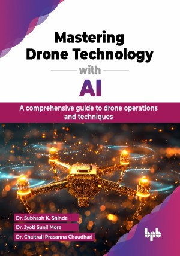

# Mastering Drone Technology with AI

A comprehensive guide to drone operations and techniques.

This is the repository for [Mastering Drone Technology with AI
](https://bpbonline.com/products/mastering-drone-technology-with-ai-1?variant=44141013696712),published by BPB Publications.

## About the Book
"Mastering Drone Technology with AI" is a detailed guide to the transformational power of AI in drone technology. It investigates how AI is transforming numerous elements of drone operations, from navigation and flight automation to data analysis and decision-making processes. The book gives readers a thorough knowledge of cutting-edge advancements including Machine Learning, computer vision, and autonomous flight systems, making it an indispensable resource for anybody interested in the convergence of AI and unmanned aerial vehicles (UAVs).

This book is a valuable resource for professionals in agriculture, logistics, surveillance, and environmental monitoring looking to integrate AI-powered drones into their work. It offers step-by-step guides and practical projects to help readers gain the skills needed to excel. By exploring the latest advancements and strategies, professionals can stay competitive in this rapidly evolving field. The book also covers safety and regulatory issues, ensuring that AI-equipped drones are used ethically and legally.

By promoting a thorough awareness of both the theoretical and practical elements of AI in drone technology, the book enables professionals to innovate and lead in their respective sectors.

## What You Will Learn
• Understand the basic components, types, and flying mechanisms of drones.

• Learn how AI enhances drone capabilities like object detection, navigation, and decision-making.

• Explore real-world uses of AI in drones for agriculture, surveillance, delivery, and environmental monitoring.

• Gain awareness of legal and ethical issues, including airspace regulations and privacy concerns.

• Get insights into future trends in drone technology and AI to stay ahead in this fast-growing industry.
